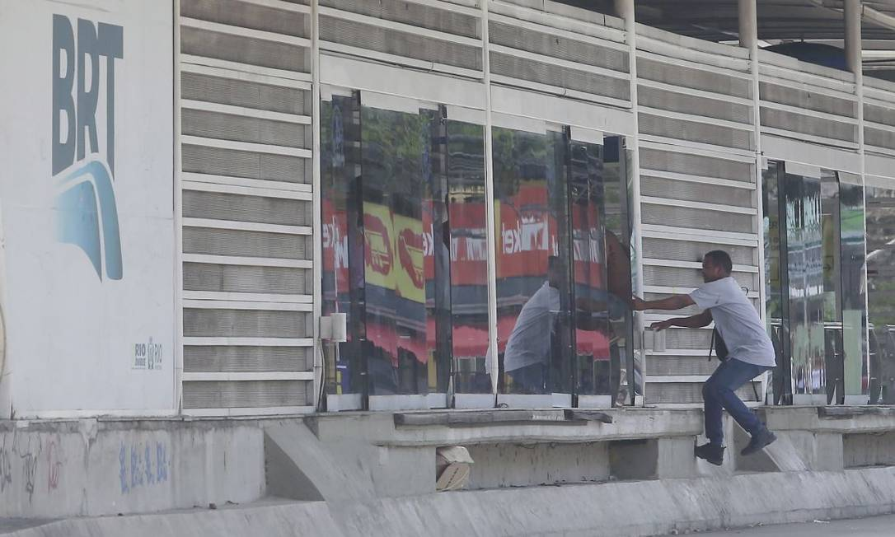

# 🧠 Detecção de Vandalismo com Visão Computacional  
### Projeto de AP1 — IBMEC 2025.1

> Monitoramento inteligente em ambientes urbanos com foco em **atos de vandalismo no transporte público**, utilizando técnicas de visão computacional com Python e OpenCV.

---

## 👥 Grupo

**Rafael Lima, Bernardo Loureiro, Luis Pastura, Daniel Gripa, João Araújo e Lucca Lanzellotti**

---

## 🎯 Objetivo

Desenvolver um sistema computacional de baixo custo capaz de detectar, em tempo real, possíveis ações de vandalismo em **estações do BRT no Rio de Janeiro**, utilizando filtros e detecção de bordas em imagens e vídeos.

---

## 📷 Exemplo de Imagem Utilizada

> 

---

## 🛠️ Tecnologias Utilizadas

- Python 3
- OpenCV
- NumPy
- (Futuramente) Deep Learning para reconhecimento de ações

---

## 📂 Etapas da Solução Implementada

### `ap1.py` – Pipeline de Detecção Básica

1. Leitura e redimensionamento da imagem
2. Conversão para escala de cinza
3. Aplicação de filtro bilateral
4. Detecção de bordas com Canny
5. Conversão de centímetros para pixels
6. Filtragem de contornos pequenos (< 2cm)
7. Exibição dos contornos filtrados

---

## 🔬 Métodos Aplicados

| Técnica           | Descrição |
|------------------|-----------|
| **Filtro Bilateral** | Suaviza sem perder as bordas. Ideal para pré-processamento |
| **Filtro Gaussiano** | Reduz ruído aplicando uma média ponderada |
| **Canny** | Detecta as bordas mais fortes da imagem |
| **Sobel** | Calcula os gradientes e destaca as mudanças de intensidade horizontal e vertical |

---

## 📈 Resultados Iniciais

- Detecção de bordas funcionou bem em ambientes com boa iluminação.
- Contornos pequenos (ex: mãos) foram identificados com precisão.
- Falsos positivos podem ocorrer devido a **sombras e texturas**.

---

## ⚠️ Limitações Atuais

- Desempenho ideal apenas em cenários diurnos.
- Dificuldade em cenas com multidões ou ângulos desfavoráveis.
- Fase inicial ainda sem uso de redes neurais profundas.

---

## 📌 Próximos Passos

- Treinamento de modelos de deep learning para:
  - Reconhecimento de ações (chutar, bater, quebrar)
  - Identificação de pessoas
- Processamento em tempo real via vídeo
- Integração com sistema de segurança pública

---

## 📚 Referência Técnica

Lima, R. F. A. S., Loureiro, B. R. B., Lanzellotti, L., Cavalcanti, D. N. G., Araújo, J. V. G., Macedo, L. C. P., & Fernandes, R. P. (2025).  
**"Vandalism Detection in Urban Environments Using Computer Vision"**  
*XLIII Brazilian Symposium on Telecommunications and Signal Processing (SBrT 2025)*.  
[DOI: 10.14209/sbrt.2024.1571036315](http://dx.doi.org/10.14209/sbrt.2024.1571036315)

---

## ▶️ Como Rodar Localmente

1. Instale as dependências:

```bash
pip install opencv-python numpy

